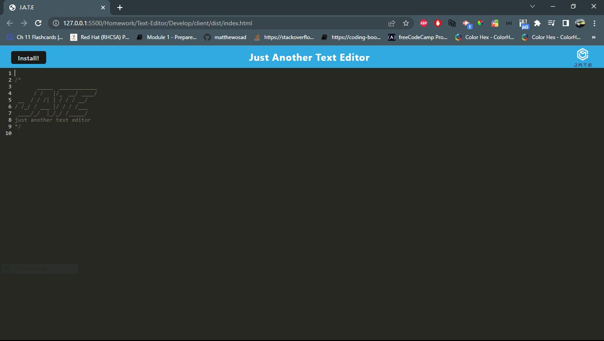

# Text-edior JATE

 

## Installation

1. Download or clone repository
2. `npm install` to install the required npm packages
3. `npm start`

## Usage

* To start using the application, open your browser and go to
  
  `http://localhost:3000/`

* Websites
  * [Github](https://github.com/mathewosad/Text-Editor)

## Screenshots

## Features

* JavaScript
* webpack
* html
* css

## License

  Copyright (c) Mathew Osad. All rights reserved.
  
  Licensed under the [MIT](LICENSE) license.
